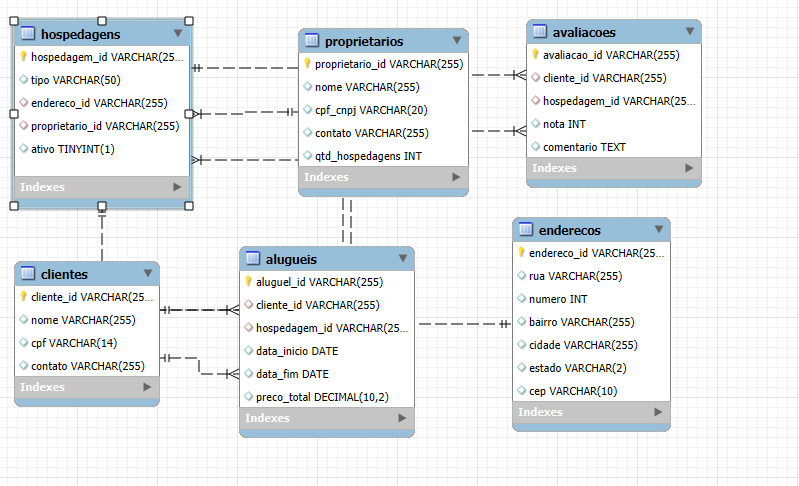

# Insight Places — Modelagem de Dados (SQL)

Projeto de modelagem para um sistema de **hospedagens e aluguéis**, incluindo proprietários, clientes, endereços, hospedagens, aluguéis e avaliações. A proposta é organizar as informações de forma clara, segura e fácil de consultar.

---

## 🔎 Visão Geral
## 🗂 Estrutura da Base de Dados

### 🧑‍💼 Proprietários (`proprietarios`)
- Armazena as informações dos **donos das hospedagens**.  
- Cada proprietário tem um **ID único**, nome, CPF ou CNPJ e informações de contato.  
- É a base de quem disponibiliza os imóveis para aluguel.  

### 👤 Clientes (`clientes`)
- Representa as pessoas que alugam as hospedagens.  
- Cada cliente também tem um **ID único**, nome, CPF e contato.  
- É quem efetivamente faz as reservas.  

### 📍 Endereços (`enderecos`)
- Guarda os dados de localização: rua, número, bairro, cidade, estado e CEP.  
- Serve para identificar onde cada hospedagem está situada.  

### 🏠 Hospedagens (`hospedagens`)
- São os imóveis disponíveis para aluguel (**casa, apartamento, pousada, etc.**).  
- Cada hospedagem tem um **tipo**, está associada a um **endereço** e a um **proprietário**.  
- Possui um campo que indica se está **ativa ou não** para aluguel.  

### 📑 Aluguéis (`alugueis`)
- Registra os **contratos de locação**.  
- Conecta **clientes** com **hospedagens**.  
- Armazena **datas de início e fim** da hospedagem e o **preço total do aluguel**.  

### ⭐ Avaliações (`avaliacoes`)
- Após a estadia, o cliente pode avaliar a hospedagem.  
- Inclui uma **nota** (ex.: de 1 a 5 estrelas) e um **comentário**.  
- Relaciona diretamente **clientes** e **hospedagens**.  

## 🔗 Relacionamentos do Modelo

- 🧑‍💼 **Um proprietário** pode ter **várias hospedagens** → (1:N)  
- 🏠 **Uma hospedagem** está vinculada a **um endereço** e a **um proprietário** → (N:1)  
- 👤 **Um cliente** pode fazer **vários aluguéis**, e cada aluguel pertence a apenas **uma hospedagem** → (1:N)  
- ⭐ **Um cliente** pode deixar **várias avaliações**, sempre relacionadas a **uma hospedagem específica** → (1:N)  

⚖️ Esse modelo garante **integridade dos dados**, já que os **IDs únicos** e as **chaves estrangeiras** controlam os vínculos entre tabelas.  
Dessa forma, conseguimos manter as informações **organizadas, consistentes e sem duplicações desnecessárias**.  
---

## 🧭 Diagrama ER



---

## ⚙️ Pré‑requisitos

* Um SGBD relacional (por exemplo, **MySQL** ou **PostgreSQL**).
* Acesso ao terminal/linha de comando ou a uma ferramenta gráfica (DBeaver, Workbench, etc.).

> Observação: o script usa tipos comuns (ex.: `VARCHAR`, `DATE`, `DECIMAL`, `bool`). Em MySQL, `bool` é tratado como `TINYINT(1)`; em PostgreSQL, `boolean` é nativo. Se necessário, ajuste mínimos podem ser feitos conforme o SGBD.

---

## ▶️ Como executar (passo a passo)

### Passo 1 — Criar banco e tabelas

Execute **primeiro** o script `insight_places_scirpt.sql`.

* **Opção A — via MySQL (CLI):**

```sql
-- 1) Entrar no MySQL
mysql -u seu_usuario -p

-- 2) Rodar o script principal (você pode rodar inteiro ou bloco a bloco — tabela por tabela)
SOURCE /caminho/para/insight_places_scirpt.sql;

-- 3) Selecionar o banco criado
USE insight_places;
```

* **Opção B — via PostgreSQL (psql):**

```sql
-- 1) Rodar o script principal
psql -U seu_usuario -f /caminho/para/insight_places_scirpt.sql

-- 2) Conectar ao banco criado
psql -U seu_usuario -d insight_places
```

> Se preferir executar **tabela por tabela**, abra o arquivo `insight_places_scirpt.sql` e rode cada bloco `CREATE TABLE ...` na ordem em que aparecem.

### Passo 2 — Popular os dados (ordem obrigatória)

Após criar as tabelas, execute os scripts de carga **nesta ordem**:

1. `1-enderecos.sql`
2. `2-clientes.sql`
3. `3-proprietarios.sql`
4. `4-hospedagens.sql`
5. `5-alugueis.sql`
6. `6-avaliacoes.sql`

> A ordem garante que as **chaves estrangeiras** encontrem os registros de referência já existentes.

---

## 🔍 Consultas de exemplo (opcional)

```sql
-- 1) Hospedagens ativas com endereço e nome do proprietário
SELECT h.hospedagem_id, h.tipo, p.nome AS proprietario,
       e.rua, e.numero, e.bairro, e.cidade, e.estado, e.cep
FROM hospedagens h
JOIN proprietarios p ON p.proprietario_id = h.proprietario_id
JOIN enderecos e     ON e.endereco_id = h.endereco_id
WHERE h.ativo = 1; -- use TRUE no PostgreSQL
```

```sql
-- 2) Histórico de aluguéis de um cliente (por CPF)
SELECT c.nome AS cliente, a.aluguel_id, h.tipo, a.data_inicio, a.data_fim, a.preco_total
FROM alugueis a
JOIN clientes c    ON c.cliente_id = a.cliente_id
JOIN hospedagens h ON h.hospedagem_id = a.hospedagem_id
WHERE c.cpf = '000.000.000-00'
ORDER BY a.data_inicio DESC;
```

```sql
-- 3) Média de notas por hospedagem
SELECT h.hospedagem_id, h.tipo, AVG(v.nota) AS media_nota, COUNT(*) AS qtd_avaliacoes
FROM hospedagens h
LEFT JOIN avaliacoes v ON v.hospedagem_id = h.hospedagem_id
GROUP BY h.hospedagem_id, h.tipo
ORDER BY media_nota DESC NULLS LAST;
```

```sql
-- 4) Receita total por proprietário
SELECT p.proprietario_id, p.nome AS proprietario, SUM(a.preco_total) AS receita_total
FROM proprietarios p
JOIN hospedagens h ON h.proprietario_id = p.proprietario_id
JOIN alugueis a    ON a.hospedagem_id  = h.hospedagem_id
GROUP BY p.proprietario_id, p.nome
ORDER BY receita_total DESC;
```

---

## 📫 Contato

Confira meu [LinkedIn](https://www.linkedin.com/in/miguel-lopes-ab8a97268/) para mais informações.